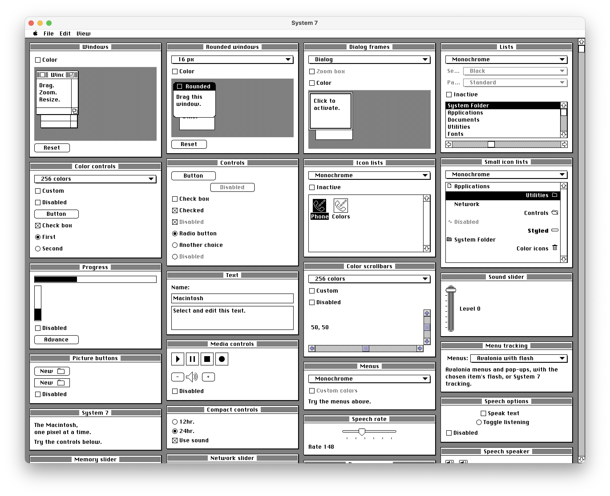

# System7.Avalonia

A Mac OS System 7 theme for [Avalonia](https://avaloniaui.net). It copies the classic look pixel for pixel, in black and white and in color.



## Features

- Standard Avalonia control themes written in XAML, with no custom rendering code.
- Buttons, check boxes, radio buttons, text boxes, lists, scroll bars, pop-up menus, menus, sliders, progress bars and window frames.
- Color depths from Monochrome to Millions, set with `System7Theme.ColorDepth`.
- Menus and pop-ups behave like normal Avalonia controls by default. Set `UseMenuFlash` or `UsePopupFlash` to add the System 7 flash when you pick an item, or `UseNativeMenuTracking` or `UseNativePopupTracking` for full System 7 behavior.

## Requirements

- .NET 10 SDK
- Avalonia 12.2 nightly (set in `Directory.Build.props`; the feed is in `nuget.config`)

## Usage

Add a reference to `src/System7.Avalonia` and add the theme to your app:

```csharp
public override void Initialize()
{
    RequestedThemeVariant = ThemeVariant.Light;
    Styles.Add(new System7Theme());
}
```

## Run the demo

```sh
dotnet run --project samples/System7.Demo.Desktop
```

There is also a browser version in `samples/System7.Demo.Browser`.

## Tests

`tests/System7.Oracle` renders every control state headless and compares the results to reference images:

```sh
dotnet run --project tests/System7.Oracle -c Release -- capture <out-dir>
dotnet run --project tests/System7.Oracle -c Release -- compare <golden-dir> <out-dir> <diff-dir>
```

## Tools

The scripts in `tools/` extract the original art and font from a System 7 disk image. The disk image and the extracted files are not part of this repository; supply your own. `tools/demo_icons.py` draws the demo's icons.

## License

MIT. See [LICENSE](LICENSE).
